# SisFall Processed Dataset Report

Generated: **2026-08-04 08:38 UTC**

Single reference document for the processed fall-detection dataset under `data/processed/`.

---

## 1. Dataset Overview

| Property | Value |
| --- | --- |
| Total windows | 84,123 |
| Total subjects | 38 (all SisFall subjects included) |
| Input tensor shape | `(windows, 64, 6)` |
| Window duration | 3.2 s at 20 Hz |
| Stride | 16 samples (0.8 s) |
| ADL windows | 57,153 (67.94%) |
| Fall windows | 26,970 (32.06%) |
| Class imbalance ratio (ADL:Fall) | 2.12:1 |

### Split Summary

| split | windows | shape | subjects | recordings | adl_windows | fall_windows |
| --- | --- | --- | --- | --- | --- | --- |
| train | 55423 | (55423, 64, 6) | 26 | 2942 | 38578 | 16845 |
| val | 15073 | (15073, 64, 6) | 6 | 829 | 9448 | 5625 |
| test | 13627 | (13627, 64, 6) | 6 | 734 | 9127 | 4500 |

### Subject Assignment (no overlap across splits)

| split | subjects | young_adults_SA | elderly_SE | subject_ids |
| --- | --- | --- | --- | --- |
| train | 26 | 14 | 12 | SA01, SA04, SA05, SA06, SA07, SA08, SA10, SA11, SA16, SA17, SA19, SA20, SA21, SA23, SE01, SE02, SE03, SE04, SE05, SE06, SE07, SE08, SE09, SE12, SE13, SE15 |
| val | 6 | 5 | 1 | SA12, SA13, SA15, SA18, SA22, SE10 |
| test | 6 | 4 | 2 | SA02, SA03, SA09, SA14, SE11, SE14 |

### Recording Coverage

| split | unique_recordings | min_windows_per_recording | median_windows_per_recording | max_windows_per_recording |
| --- | --- | --- | --- | --- |
| train | 2942 | 9 | 15.0000 | 222 |
| val | 829 | 12 | 15.0000 | 122 |
| test | 734 | 12 | 15.0000 | 122 |

---

## 2. Preprocessing Configuration

| Step | Setting |
| --- | --- |
| Raw sampling rate | 200 Hz |
| Processed sampling rate | 20 Hz |
| Filtering | Butterworth low-pass, order 2, cutoff 5 Hz |
| Downsampling | Factor 10 |
| Normalization | StandardScaler (fit on train only) |
| Split strategy | Subject-wise 70/15/15 (largest-remainder) |
| Window size | 64 timesteps |
| Stride | 16 timesteps |

**Channels per window (index order):**

| Index | Channel | Sensor |
| ---: | --- | --- |
| 0 | acc1_x | ADXL345 accelerometer X |
| 1 | acc1_y | ADXL345 accelerometer Y |
| 2 | acc1_z | ADXL345 accelerometer Z |
| 3 | gyro_x | ITG3200 gyroscope X |
| 4 | gyro_y | ITG3200 gyroscope Y |
| 5 | gyro_z | ITG3200 gyroscope Z |

**Label mapping:** `0` = ADL, `1` = Fall

### Scaler (train-fit StandardScaler)

| Channel | Train mean (raw) | Train std (raw) |
| --- | ---: | ---: |
| acc1_x | 0.9629 | 93.1734 |
| acc1_y | -178.7820 | 133.7250 |
| acc1_z | -38.1917 | 115.0489 |
| gyro_x | -11.9196 | 360.0833 |
| gyro_y | 35.7739 | 436.8326 |
| gyro_z | -5.4918 | 318.5940 |

---

## 3. Class Distribution

| split | class_label | class_name | window_count | percentage | total_windows |
| --- | --- | --- | --- | --- | --- |
| train | 0 | ADL | 38578 | 69.6065 | 55423 |
| train | 1 | Fall | 16845 | 30.3935 | 55423 |
| val | 0 | ADL | 9448 | 62.6816 | 15073 |
| val | 1 | Fall | 5625 | 37.3184 | 15073 |
| test | 0 | ADL | 9127 | 66.9773 | 13627 |
| test | 1 | Fall | 4500 | 33.0227 | 13627 |

### Class distribution plots

**Bar chart**

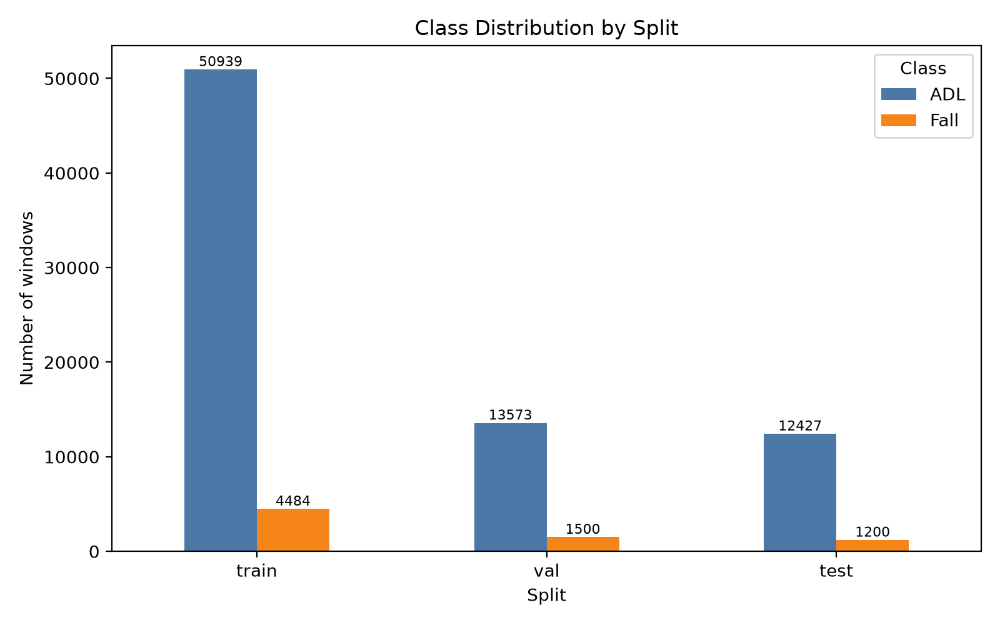

**Pie chart**

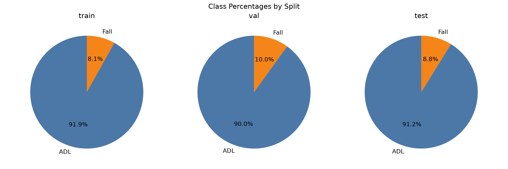

**Class balance comparison**

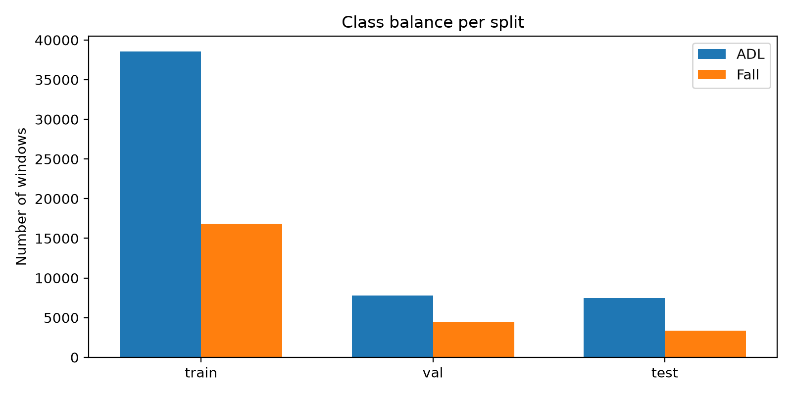

---

## 4. Data Integrity

| split | windows | shape | subjects | recordings | nan_count | inf_count | abs_max | constant_windows | adl_windows | fall_windows |
| --- | --- | --- | --- | --- | --- | --- | --- | --- | --- | --- |
| train | 55423 | (55423, 64, 6) | 26 | 2942 | 0 | 0 | 38.1595 | 0 | 38578 | 16845 |
| val | 15073 | (15073, 64, 6) | 6 | 829 | 0 | 0 | 18.9812 | 0 | 9448 | 5625 |
| test | 13627 | (13627, 64, 6) | 6 | 734 | 0 | 0 | 48.5212 | 0 | 9127 | 4500 |

All splits contain both classes. No NaN or infinite values detected.

---

## 5. Channel Statistics (normalized values)

| split | channel | mean | std | min | max | p25 | p50 | p75 |
| --- | --- | --- | --- | --- | --- | --- | --- | --- |
| train | acc1_x | 0.0005 | 1.0091 | -13.8934 | 11.6163 | -0.1993 | 0.0297 | 0.2462 |
| train | acc1_y | -0.0121 | 1.0142 | -6.8997 | 6.9443 | -0.5540 | -0.3779 | 0.8173 |
| train | acc1_z | -0.0323 | 0.9899 | -10.3763 | 8.8393 | -0.5880 | -0.0818 | 0.4384 |
| train | gyro_x | 0.0005 | 1.0732 | -36.8906 | 38.1595 | -0.1921 | 0.0001 | 0.2296 |
| train | gyro_y | -0.0017 | 1.0696 | -29.6888 | 27.5684 | -0.1633 | 0.0020 | 0.1698 |
| train | gyro_z | -0.0002 | 1.0741 | -38.0956 | 37.6419 | -0.1368 | 0.0022 | 0.1336 |
| val | acc1_x | -0.0917 | 1.0845 | -12.0087 | 11.1325 | -0.2933 | -0.0360 | 0.1991 |
| val | acc1_y | 0.0097 | 1.0422 | -7.2551 | 6.5152 | -0.5670 | -0.3821 | 0.9506 |
| val | acc1_z | 0.3248 | 1.0002 | -8.2031 | 9.2057 | -0.2097 | 0.3559 | 0.8694 |
| val | gyro_x | -0.0013 | 1.1744 | -18.9812 | 17.5454 | -0.1727 | 0.0036 | 0.2077 |
| val | gyro_y | 0.0113 | 1.0933 | -11.7561 | 18.5895 | -0.1326 | 0.0445 | 0.1639 |
| val | gyro_z | 0.0147 | 1.1315 | -16.5250 | 15.0641 | -0.1061 | 0.0044 | 0.1200 |
| test | acc1_x | -0.0408 | 1.0060 | -11.2061 | 9.3332 | -0.2085 | 0.0186 | 0.2543 |
| test | acc1_y | -0.0574 | 1.0091 | -5.6359 | 6.7121 | -0.5890 | -0.4161 | 0.7306 |
| test | acc1_z | 0.1501 | 0.9994 | -9.0726 | 11.0164 | -0.4316 | 0.1188 | 0.6742 |
| test | gyro_x | 0.0414 | 1.1941 | -48.5212 | 18.8698 | -0.1785 | 0.0251 | 0.2561 |
| test | gyro_y | -0.0270 | 1.0486 | -15.2681 | 15.1227 | -0.1810 | -0.0200 | 0.1531 |
| test | gyro_z | 0.0081 | 1.1650 | -15.8501 | 20.0049 | -0.1282 | -0.0005 | 0.1323 |

### Distribution plots

**Channel boxplots by split**

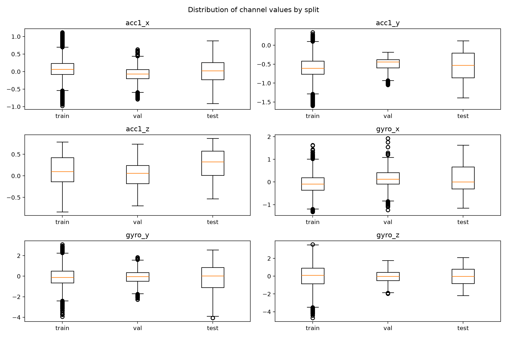

**Train signal histograms**

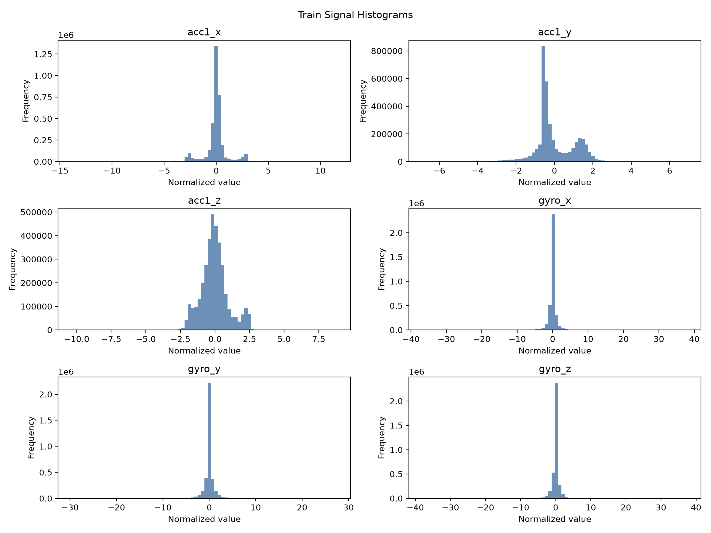

**Validation signal histograms**

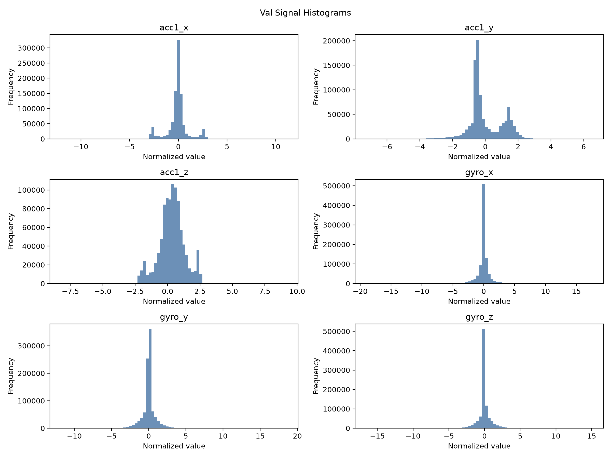

**Test signal histograms**

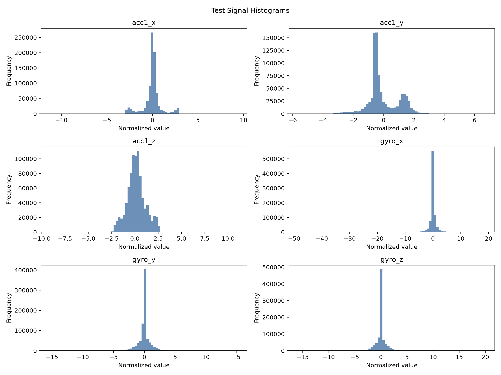

**Train signal boxplots**

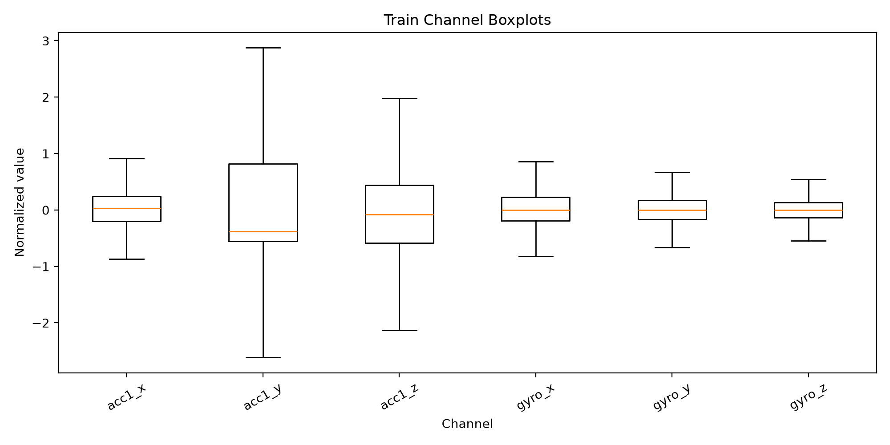

**Validation signal boxplots**

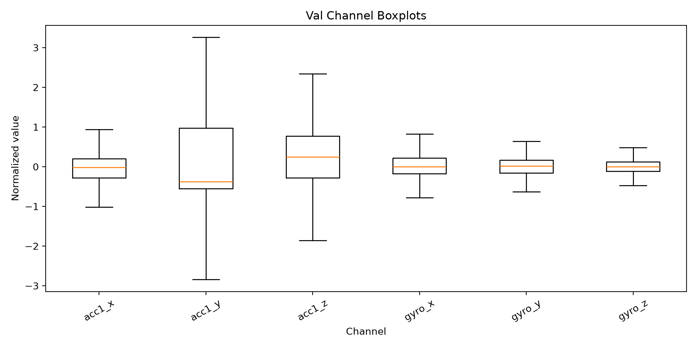

**Test signal boxplots**

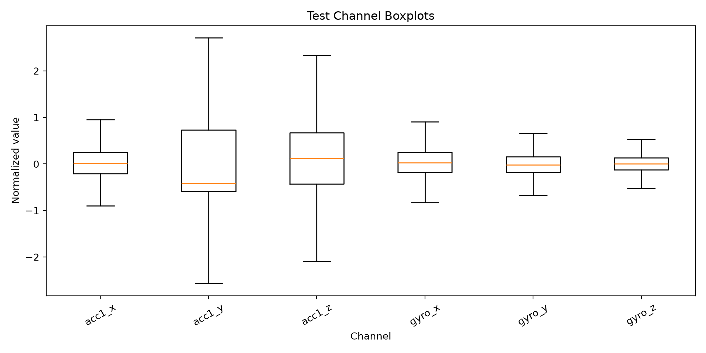

---

## 6. Acceleration Magnitude Analysis

Peak acceleration magnitude per window: `sqrt(acc1_x² + acc1_y² + acc1_z²)` — computed on normalized accelerometer channels.

| split | class_name | windows | peak_mean | peak_median | peak_std | peak_p95 | peak_max | magnitude_mean |
| --- | --- | --- | --- | --- | --- | --- | --- | --- |
| train | ADL | 38578 | 2.0161 | 1.7589 | 1.0327 | 3.8400 | 5.8997 | 1.1636 |
| train | Fall | 16845 | 3.6283 | 2.9302 | 2.4769 | 8.7598 | 15.3133 | 2.0447 |
| val | ADL | 9448 | 2.0565 | 1.7644 | 1.0633 | 4.1739 | 5.9814 | 1.2104 |
| val | Fall | 5625 | 3.6226 | 3.0101 | 2.3975 | 8.2802 | 12.7154 | 2.0639 |
| test | ADL | 9127 | 2.0075 | 1.7354 | 0.9625 | 3.6480 | 6.0781 | 1.1985 |
| test | Fall | 4500 | 3.4564 | 2.9080 | 2.2318 | 7.6794 | 11.7798 | 1.9964 |

**Interpretation:** Fall windows show higher median and peak acceleration than ADL across all splits.

### Acceleration spike plots

**ADL vs Fall spike histograms**

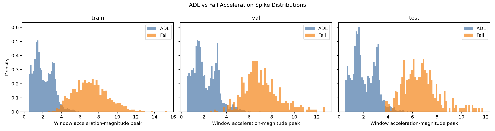

**ADL vs Fall spike boxplots**

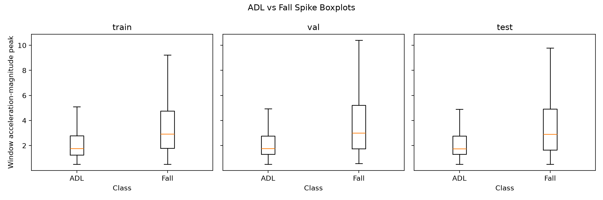

---

## 7. Gyroscope Magnitude Analysis

Peak gyroscope magnitude per window: `sqrt(gyro_x² + gyro_y² + gyro_z²)` — computed on normalized gyroscope channels.

| split | class_name | windows | peak_mean | peak_median | peak_p95 | peak_max |
| --- | --- | --- | --- | --- | --- | --- |
| train | ADL | 38578 | 3.1933 | 2.8176 | 6.7991 | 49.1466 |
| train | Fall | 16845 | 4.2880 | 1.7929 | 14.9362 | 37.1098 |
| val | ADL | 9448 | 3.3752 | 3.0549 | 7.4385 | 12.6993 |
| val | Fall | 5625 | 4.2760 | 1.8995 | 14.0922 | 21.8619 |
| test | ADL | 9127 | 3.4046 | 3.1155 | 7.2764 | 11.5354 |
| test | Fall | 4500 | 4.3558 | 2.4413 | 13.8768 | 48.6821 |

---

## 8. Temporal Structure (Autocorrelation)

Mean lag-1 autocorrelation (train): 0.7672  
Mean lag-8 autocorrelation (train): 0.0648

### Autocorrelation plots

**Train autocorrelation**

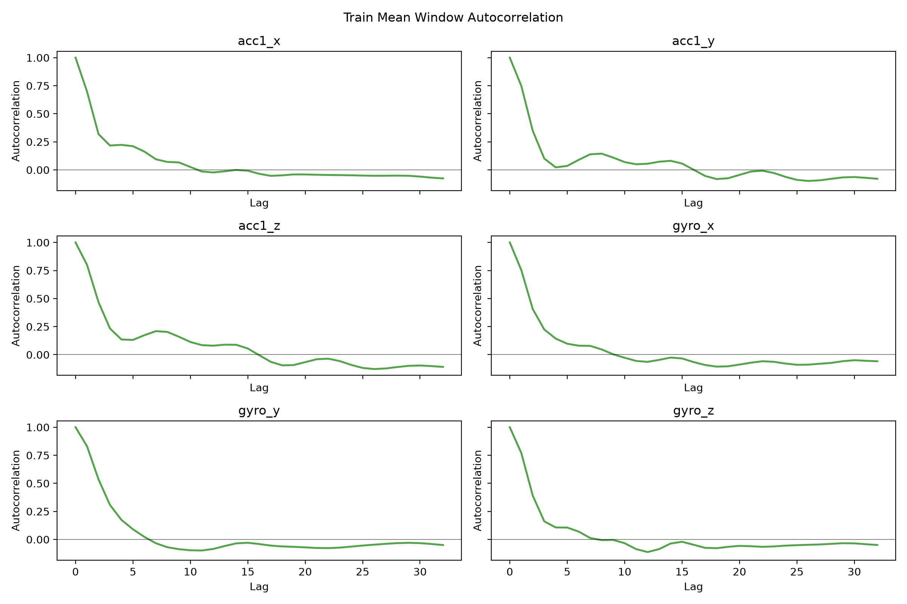

**Validation autocorrelation**

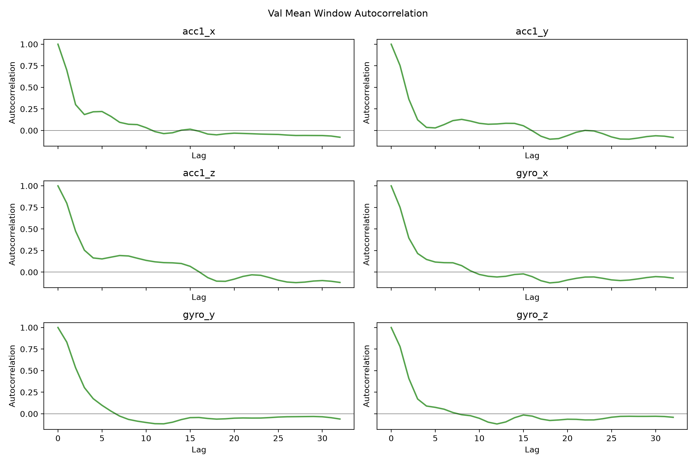

**Test autocorrelation**

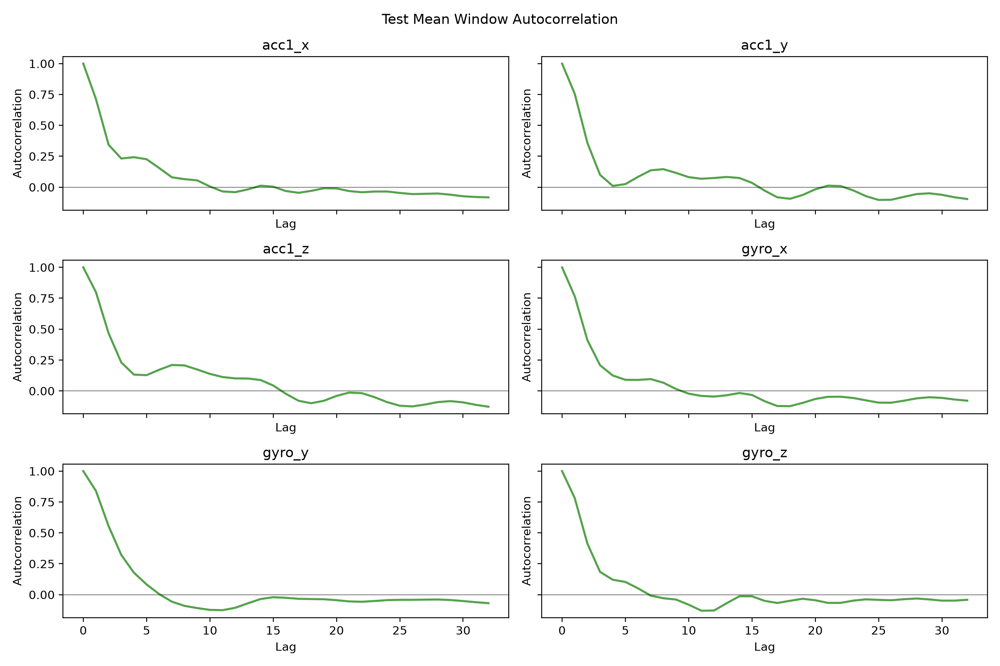

---

## 9. Outlier Profile

Outliers were detected but not removed (high-amplitude motion is informative for fall detection).

| split | channel | sample_count | iqr_outliers | iqr_outlier_percentage | iqr_lower_bound | iqr_upper_bound | zscore_outliers | zscore_outlier_percentage | zscore_threshold |
| --- | --- | --- | --- | --- | --- | --- | --- | --- | --- |
| train | acc1_x | 3547072 | 608827 | 17.1642 | -0.8676 | 0.9144 | 15934 | 0.4492 | 3.0000 |
| train | acc1_y | 3547072 | 44835 | 1.2640 | -2.6111 | 2.8744 | 21348 | 0.6018 | 3.0000 |
| train | acc1_z | 3547072 | 242806 | 6.8453 | -2.1275 | 1.9780 | 6566 | 0.1851 | 3.0000 |
| train | gyro_x | 3547072 | 678660 | 19.1330 | -0.8246 | 0.8621 | 77014 | 2.1712 | 3.0000 |
| train | gyro_y | 3547072 | 904997 | 25.5139 | -0.6631 | 0.6695 | 75297 | 2.1228 | 3.0000 |
| train | gyro_z | 3547072 | 1010394 | 28.4853 | -0.5425 | 0.5392 | 52181 | 1.4711 | 3.0000 |
| val | acc1_x | 964672 | 184146 | 19.0890 | -1.0319 | 0.9376 | 3332 | 0.3454 | 3.0000 |
| val | acc1_y | 964672 | 8108 | 0.8405 | -2.8435 | 3.2271 | 6259 | 0.6488 | 3.0000 |
| val | acc1_z | 964672 | 44289 | 4.5911 | -1.8283 | 2.4880 | 2200 | 0.2281 | 3.0000 |
| val | gyro_x | 964672 | 212543 | 22.0327 | -0.7434 | 0.7784 | 21805 | 2.2604 | 3.0000 |
| val | gyro_y | 964672 | 276334 | 28.6454 | -0.5774 | 0.6087 | 21370 | 2.2153 | 3.0000 |
| val | gyro_z | 964672 | 314317 | 32.5828 | -0.4453 | 0.4591 | 20859 | 2.1623 | 3.0000 |
| test | acc1_x | 872128 | 158809 | 18.2094 | -0.9026 | 0.9484 | 3431 | 0.3934 | 3.0000 |
| test | acc1_y | 872128 | 10914 | 1.2514 | -2.5685 | 2.7101 | 3800 | 0.4357 | 3.0000 |
| test | acc1_z | 872128 | 30792 | 3.5307 | -2.0903 | 2.3329 | 1391 | 0.1595 | 3.0000 |
| test | gyro_x | 872128 | 178406 | 20.4564 | -0.8304 | 0.9080 | 21267 | 2.4385 | 3.0000 |
| test | gyro_y | 872128 | 247944 | 28.4298 | -0.6821 | 0.6542 | 17613 | 2.0195 | 3.0000 |
| test | gyro_z | 872128 | 280301 | 32.1399 | -0.5190 | 0.5230 | 18475 | 2.1184 | 3.0000 |

### Outlier plots

**IQR outlier percentages**

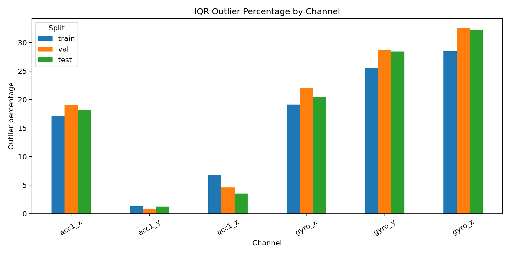

**Z-score outlier percentages**

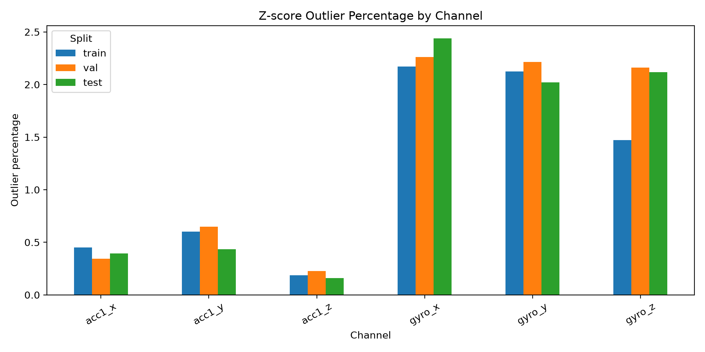

---

## 10. Sample Window Visualizations

### First window from each split

**Train — first window (acc axes)**

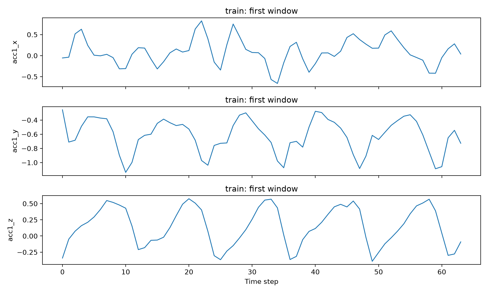

**Validation — first window**

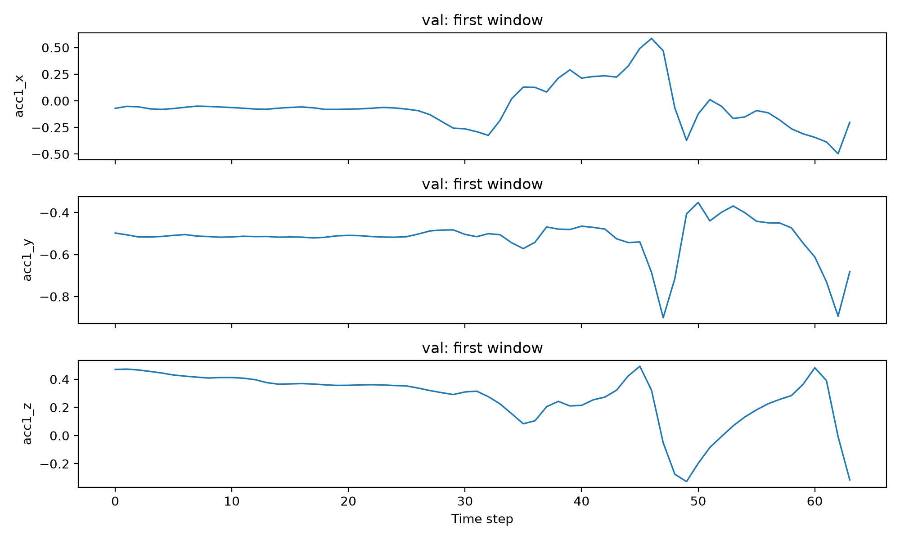

**Test — first window**

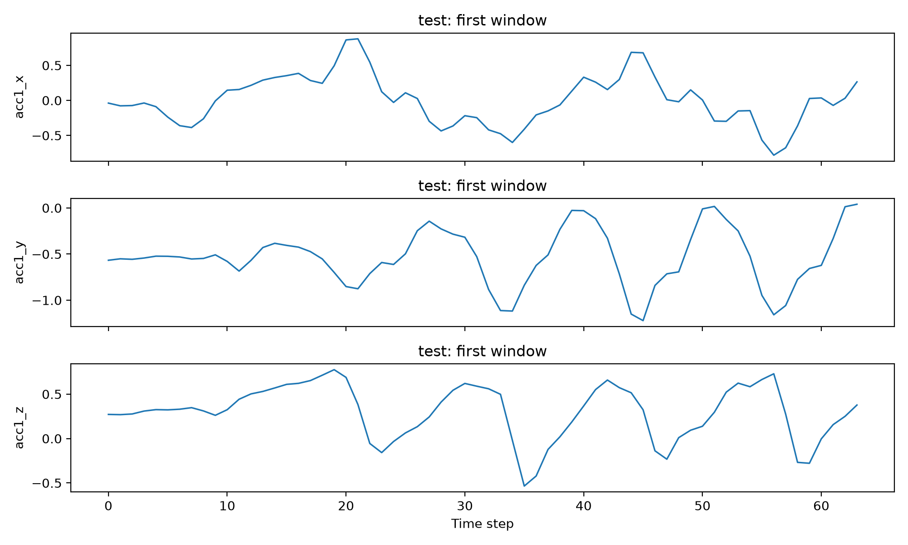

**Low-pass filter check (raw pipeline)**

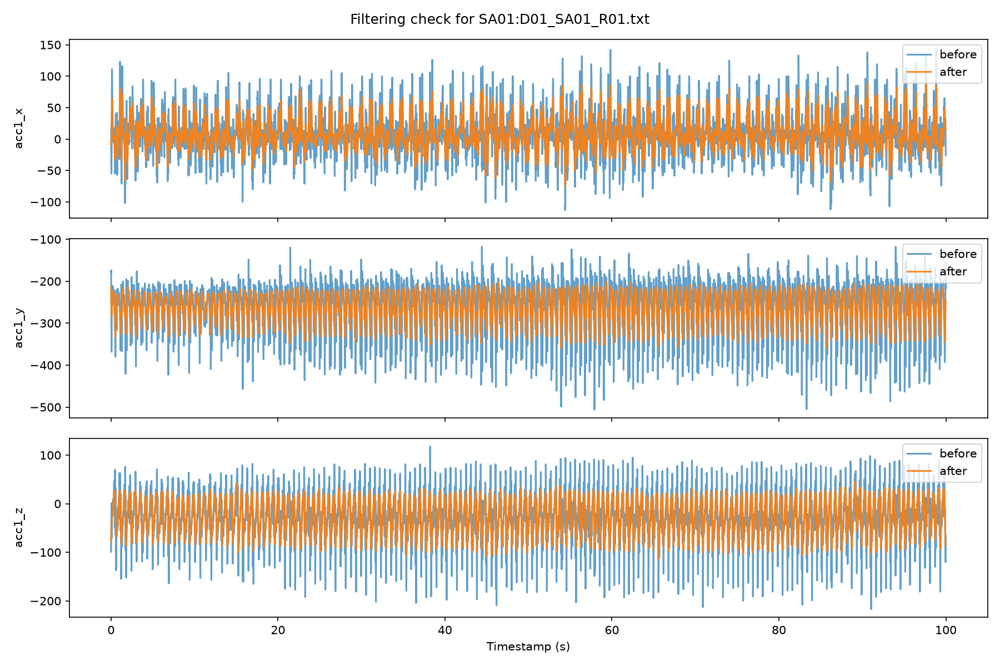

---

## 11. Saved Artifacts

| File | Description |
| --- | --- |
| `train.npy` | Training windows `(N, 64, 6)` |
| `train_labels.npy` | Binary labels |
| `train_subject_ids.npy` | Subject ID per window |
| `train_recording_ids.npy` | Recording ID per window |
| `val.npy`, `val_*.npy` | Validation split |
| `test.npy`, `test_*.npy` | Test split |
| `scaler.pkl` | Fitted StandardScaler |
| `plots/` | All visualization PNGs |

---

## 12. Modeling Notes

- **Input shape for deep learning:** `(batch, 64, 6)` for LSTM/CNN; or `(batch, 6, 64)` if channels-first.
- **Class imbalance:** Use weighted loss or balanced batching (~70% ADL / ~30% Fall).
- **Evaluation:** Prefer recording-level or subject-level metrics (windows overlap with 75% stride).
- **Ready for:** 1D CNN, LSTM, CNN-LSTM, Transformer-based HAR models.
