# Fall Detection System — End-to-End Project Report

Generated: 2026-09-15 07:48 UTC
Canonical severity run: `k3_20260913T135813Z`
Severity artifacts: `data/processed/deprecated_severity/20260914T055846Z/data/processed/severity/runs/k3_20260913T135813Z`
Severity evaluation: `data/processed/deprecated_severity/20260914T055846Z/results/cnn_lstm_baseline/severity_eval/k3_20260913T135813Z`

## 1. Problem Statement & Motivation

Falls are a leading cause of injury and loss of independence among older adults. Wearable IMU sensors can detect falls in real time, but practical systems must handle class imbalance, subject variability, and noisy ADL activities while remaining deployable on low-power hardware. This project builds an end-to-end SisFall pipeline: ingestion, impact-centered preprocessing, unsupervised severity proxy labeling, and compact CNN/CNN-LSTM detectors.

## 2. Dataset Overview

- Processed windows: **84,123** total — ADL/background **76,939**, fall **7,184**.
- Overall fall-window proportion: **8.54%** (impact-centered labeling).
- SisFall: 38 subjects (26 train / 6 val / 6 test), subject-disjoint splits at ~70/15/15.
- Tensor shape per window: `(64, 6)` at 20 Hz → 3.2 s; channels: acc1 xyz + gyro xyz.

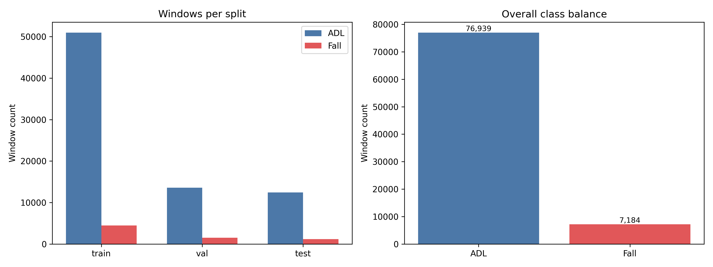

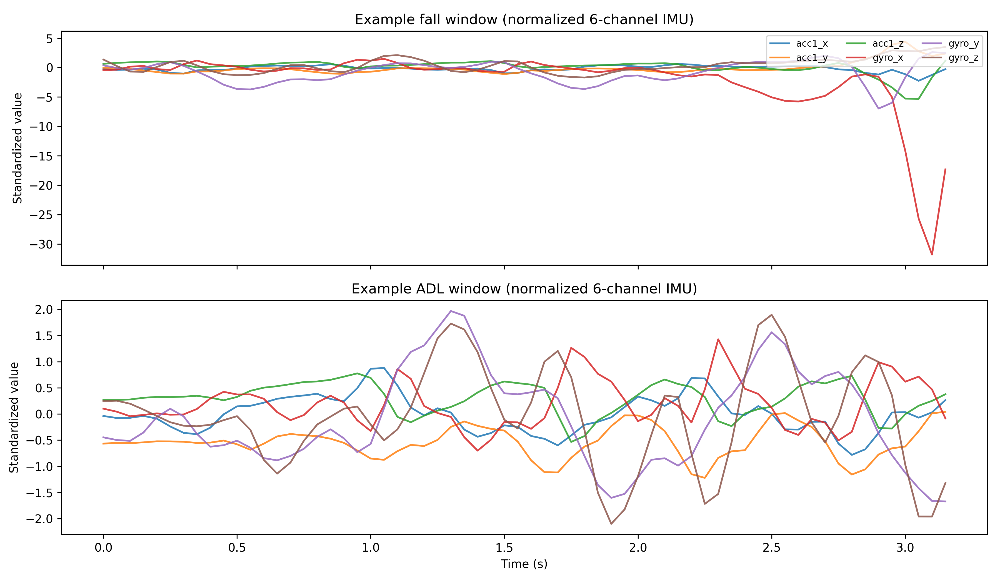

## 3. Preprocessing & Windowing

- Retained 6 channels (ADXL345 acc1 + ITG3200 gyro); removed second accelerometer (MMA8451Q).
- Butterworth low-pass 5 Hz (order 4) applied per recording **before** 200 Hz → 20 Hz downsampling.
- Train-only StandardScaler on 6 channels; sliding windows 64 samples, stride 16 (75% overlap).
- Impact-centered fall labels: only windows containing detected impact peak are label 1.

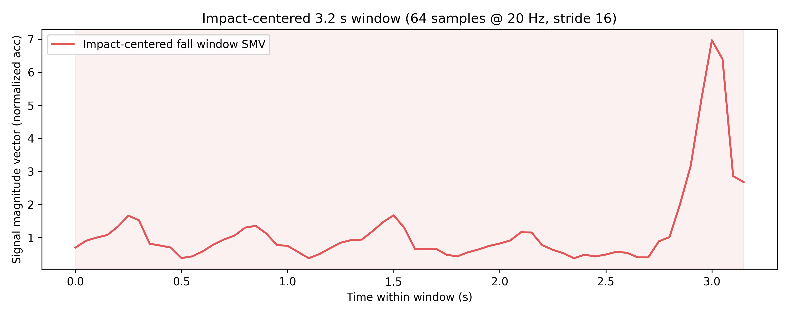

## 4. Exploratory Data Analysis

- Falls show higher peak signal magnitude vector (SMV) than ADL windows in normalized space.

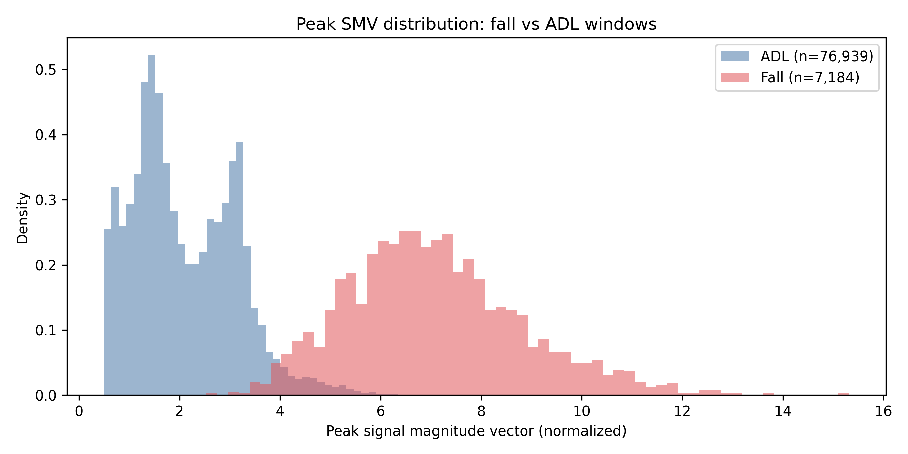

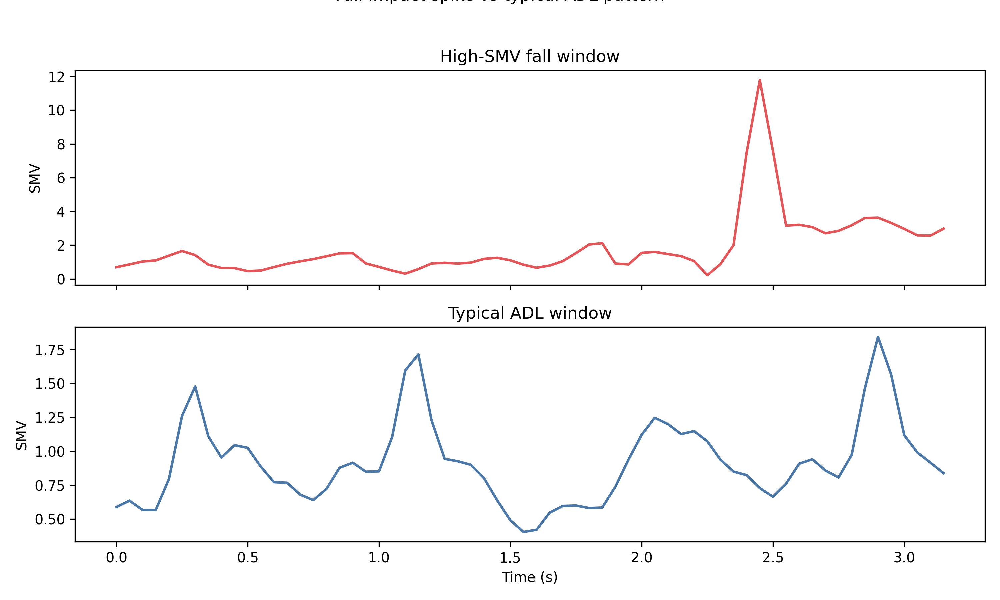

## 5. Baseline Model (CNN-only)

- Architecture: 3× Conv1D blocks + GlobalAveragePooling + Dense; isolates spatial/temporal convolution without recurrence.
- SVM/hand-crafted features were not pursued; CNN baselines directly consume window tensors for fair comparison with CNN-LSTM.
- Test @ 0.50: precision **0.9761**, recall **0.9867**, F1 **0.9814**.

## 6. Final Model (CNN-LSTM)

- Architecture: Conv1D → Conv1D → LSTM(64, `unroll=True`) → GlobalAveragePooling → Dense; **46,817** parameters. `unroll=True` expands the 16-step LSTM sequence explicitly for stable training on short windows.
- Best epoch: **4**; early stopping after **14** epochs.
- Test @ 0.50: precision **0.9770**, recall **0.9925**, F1 **0.9847**.
- Recording-level fall recall @ 0.50: **1.0000** (300/300 fall recordings).

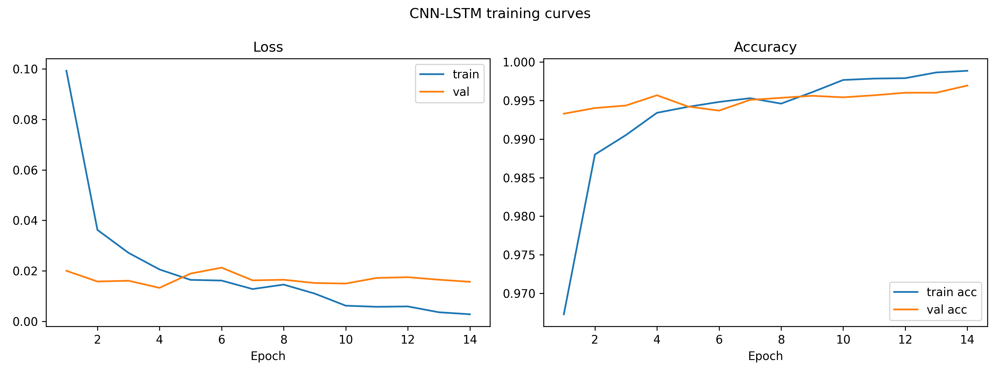

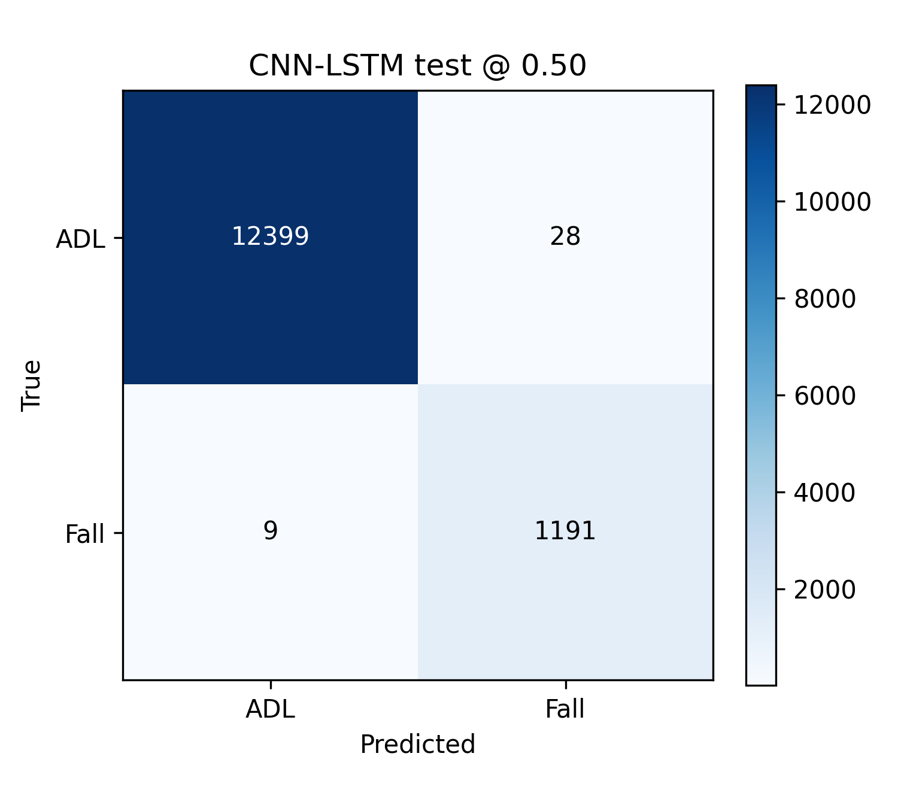

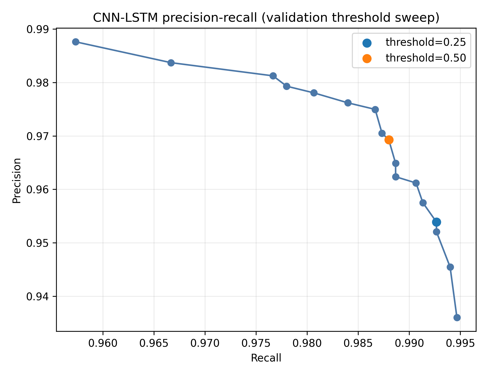

## 7. Severity Labeling Pipeline

- Stage 1: 58 hand-crafted IMU features from fall windows → train-only StandardScaler → K-Means k=3.
- Stage 2: Isolation Forest (contamination 2%, 256 trees) flags atypical falls as Uncertain (-1).
- Cluster→severity mapping by ascending acc/gyro peak intensity: Mild / Moderate / Severe.
- **Sensor-derived relative severity**, not clinically validated injury severity.

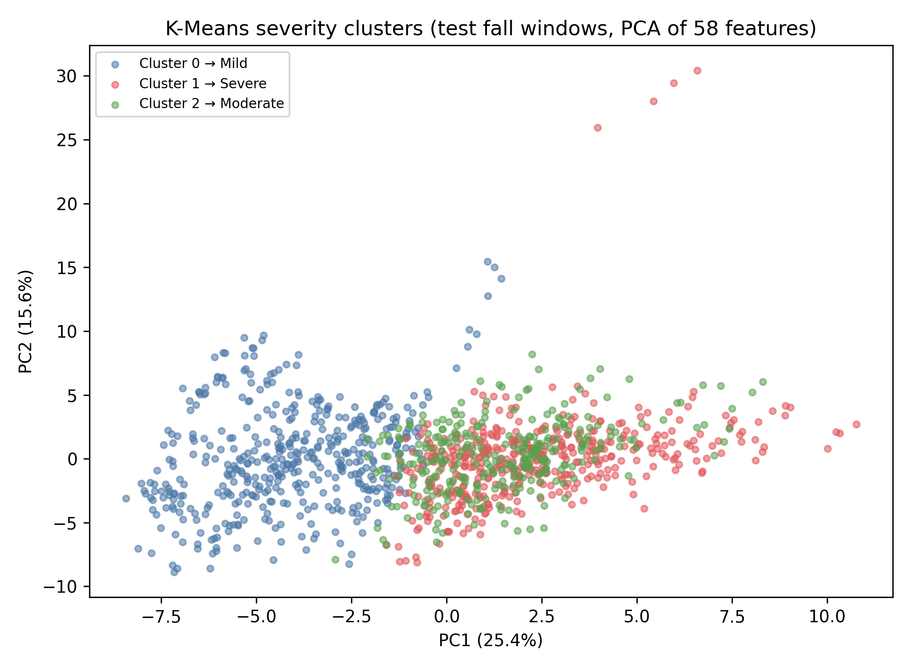

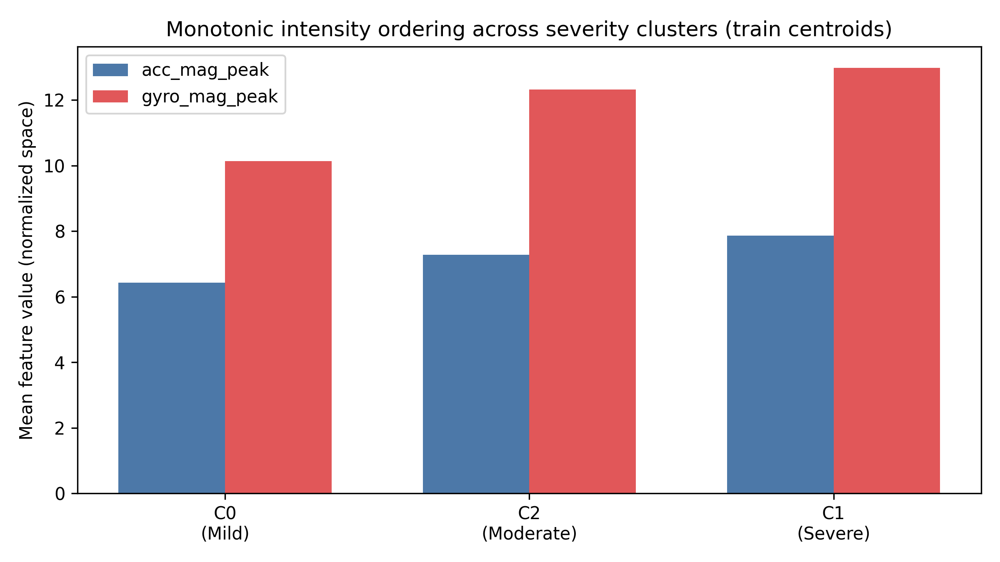

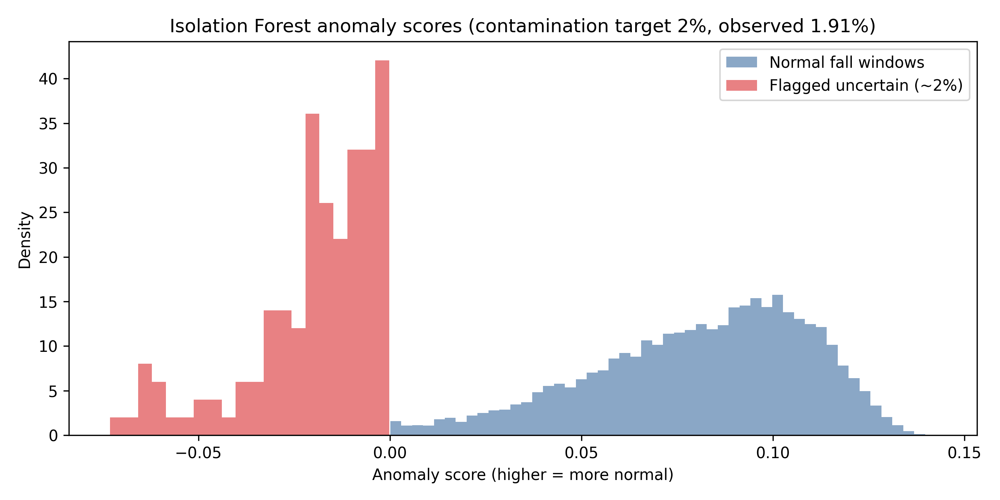

## 8. Severity-wise Model Evaluation

- Uncertain (-1): recall **0.9583** (23/24 windows).
- Mild: recall **0.9865** (440/446 windows).
- Moderate: recall **1.0000** (298/298 windows).
- Severe: recall **0.9954** (430/432 windows).

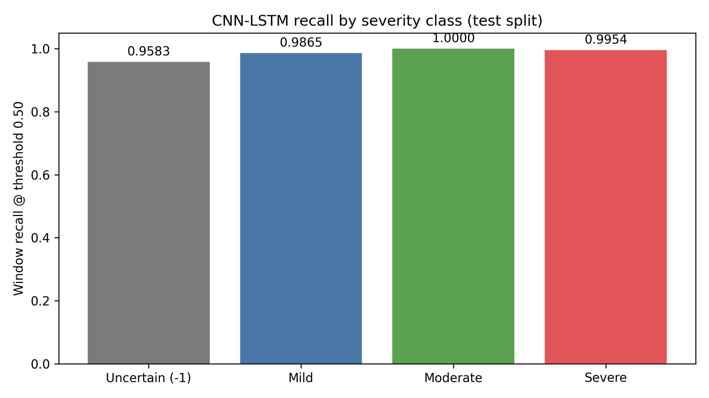

## 9. Known Limitations & Open Issues

- Controlled laboratory falls (SisFall); limited generalization to naturalistic/unwitnessed falls.
- 38 subjects — moderate sample size; subject-disjoint splits reduce leakage but increase variance.
- **Open Issue:** ADL false-trigger count disagreement at threshold 0.50: recording_level_eval reports 0, false_positive_diagnostics reports 1.
- README / PROJECT_STATUS_REPORT may lag `run_metadata.json`; prefer artifact-backed metrics in this report.
- Severity labels are unsupervised proxies; do not claim clinical ground truth.

## 10. Next Steps

1. Freeze one canonical timestamped run (preprocessing → severity k=3 → evaluation → diagnostics).
2. Multi-task model: binary fall head + severity head on detected impact windows.
3. FiLM / subject-conditioning prototype for cross-subject robustness.
4. Four-way comparison table: CNN vs CNN-LSTM vs multi-task vs FiLM (same splits/threshold protocol).
5. Cross-file consistency validator (TP/FP/FN/TN, recording FP counts, severity/anomaly counts).
6. Subject/activity robustness analysis (e.g., ADL D13/D14 borderline activities).
