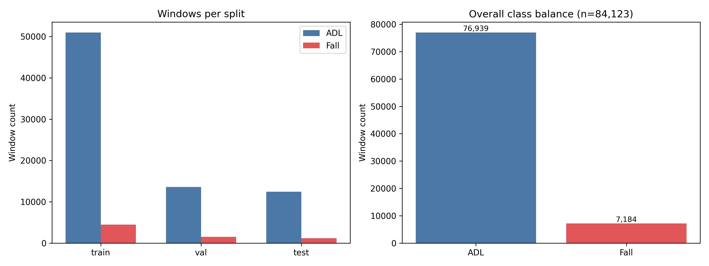
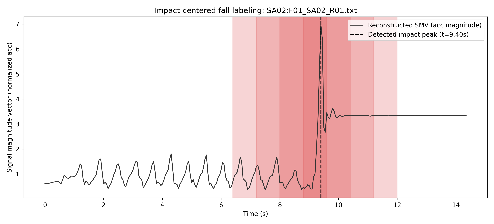
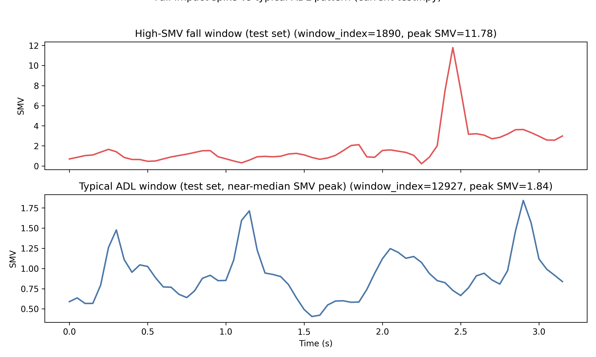
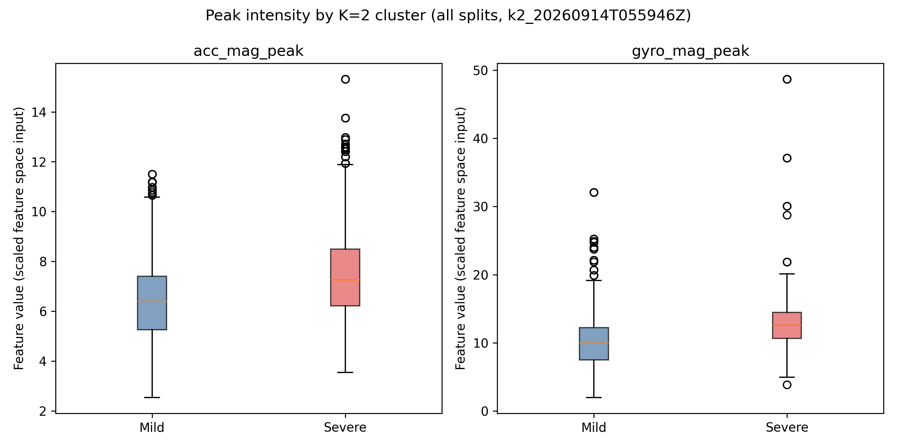
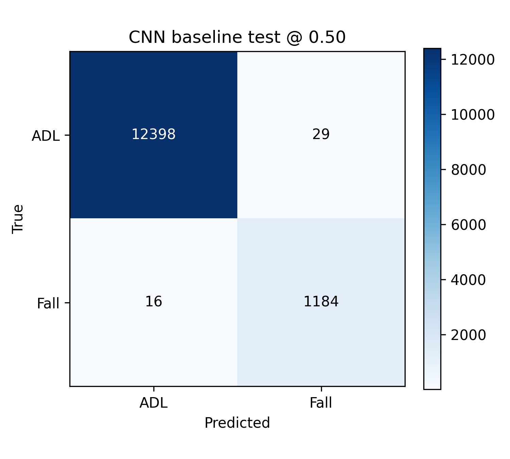
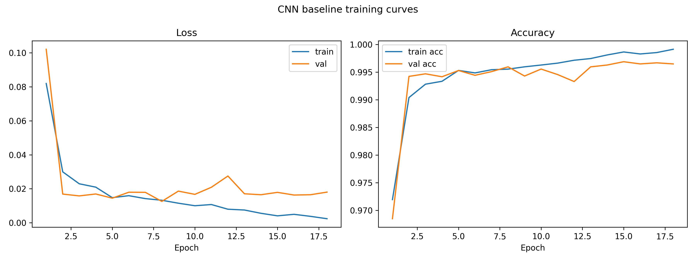
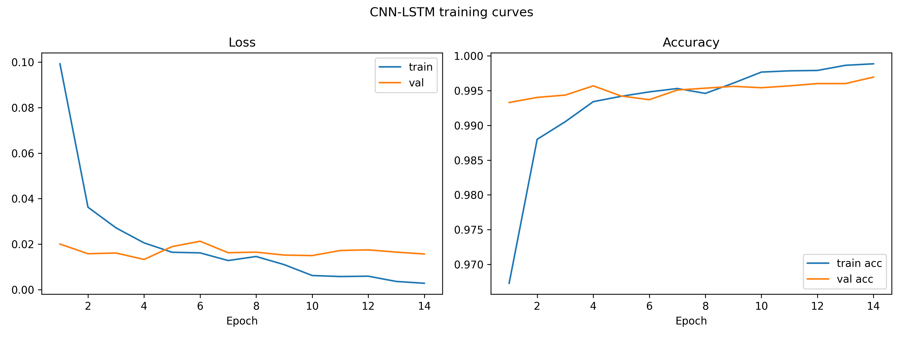
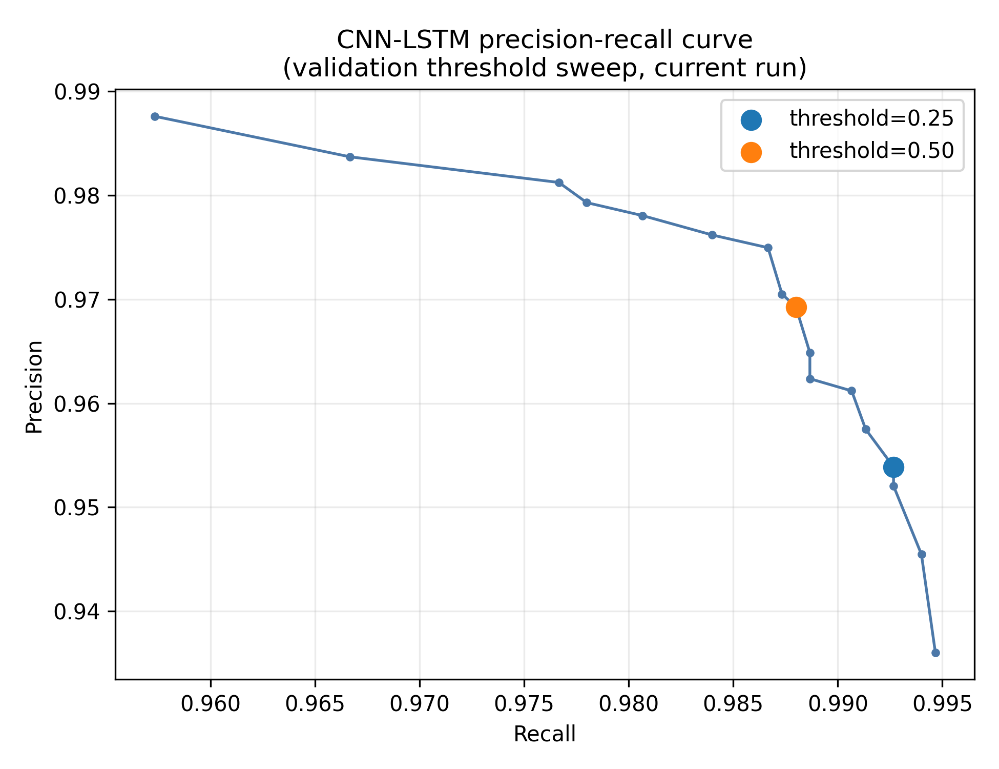

# Review 2 — Fall Detection Pipeline (Raw Data through CNN-LSTM Classification)

Scope: raw dataset through binary fall/not-fall classification (CNN baseline and CNN-LSTM). Severity clustering (K=2) is included per explicit confirmation for this review; the severity-aware CNN-LSTM model itself (a distinct future milestone) is out of scope. Every number and plot below traces to a real, current artifact file cited immediately beneath it.

## 1. Dataset

SisFall contains 38 subjects (23 young adults `SA01`-`SA23`, 15 elderly `SE01`-`SE15`), each performing 19 ADL activity types (`D01`-`D19`) and 15 fall types (`F01`-`F15`) across multiple trials. Each raw recording file has 9 comma-separated integer sensor values per line (`acc1_x/y/z`, `gyro_x/y/z`, `acc2_x/y/z`), terminated by a semicolon, sampled at 200 Hz.

**Table 1.1 — Subject-wise split (train/val/test)**

| split   |   subjects |   recordings |   windows_total |   windows_adl |   windows_fall |
|:--------|-----------:|-------------:|----------------:|--------------:|---------------:|
| train   |         26 |         2942 |           55423 |         50939 |           4484 |
| val     |          6 |          829 |           15073 |         13573 |           1500 |
| test    |          6 |          734 |           13627 |         12427 |           1200 |

*Source: `data/processed/{split}_subject_ids.npy, {split}_recording_ids.npy, {split}_labels.npy`*

**Table 1.2 — Sample structure of one raw recording** (`SisFall_dataset/SA01/D01_SA01_R01.txt`, first 10 rows, 6 retained channels). The raw file has 9 comma-separated columns per row (acc1 xyz, gyro xyz, acc2 xyz), terminated by a semicolon; the 3 acc2 columns are dropped during preprocessing (see Section 2).

|   row_index |   acc1_x |   acc1_y |   acc1_z |   gyro_x |   gyro_y |   gyro_z |
|------------:|---------:|---------:|---------:|---------:|---------:|---------:|
|           0 |       17 |     -179 |      -99 |      -18 |     -504 |     -352 |
|           1 |       15 |     -174 |      -90 |      -53 |     -568 |     -306 |
|           2 |        1 |     -176 |      -81 |      -84 |     -613 |     -271 |
|           3 |      -10 |     -180 |      -77 |     -104 |     -647 |     -227 |
|           4 |      -21 |     -191 |      -63 |     -128 |     -675 |     -191 |
|           5 |      -37 |     -225 |      -59 |     -146 |     -700 |     -159 |
|           6 |      -36 |     -243 |      -46 |     -166 |     -722 |     -131 |
|           7 |      -44 |     -271 |      -38 |     -190 |     -738 |     -107 |
|           8 |      -51 |     -312 |      -33 |     -210 |     -752 |      -90 |
|           9 |      -55 |     -339 |      -19 |     -214 |     -764 |      -72 |

*Source: `SisFall_dataset/SA01/D01_SA01_R01.txt`*

**Figure 1.1 — Class balance (ADL vs Fall) and per-split window counts**

*Source: `data/processed/{train,val,test}_labels.npy`*

## 2. Preprocessing

The second accelerometer (`acc2`, MMA8451Q) is dropped, keeping only the primary accelerometer (`acc1`, ADXL345) and gyroscope (ITG3200) — 6 channels. Each recording is independently low-pass filtered (Butterworth) to remove high-frequency noise while preserving activity-relevant motion, then downsampled from 200 Hz to 20 Hz. A `StandardScaler` is fit on the train split only and applied to all splits, so no validation/test statistics leak into normalization.

**Figure 2.1 — Raw vs Butterworth-filtered signal** (acc1 x/y/z, one representative recording, before vs after the low-pass filter). Reused directly from the real preprocessing pipeline's own output (150 DPI original; not regenerated at 300 DPI to preserve exact provenance to the actual filtering step).

*Source: `data/processed/filter_plot.png`*

**Table 2.1 — Preprocessing parameters**

| parameter                    | value                                           |
|:-----------------------------|:------------------------------------------------|
| Original sampling rate       | 200 Hz                                          |
| Downsampled rate             | 20 Hz                                           |
| Butterworth filter type      | low-pass                                        |
| Butterworth filter order     | 2 (as invoked; function default is 4, not used) |
| Butterworth cutoff frequency | 5 Hz                                            |
| Channels retained            | 6 (acc1_x/y/z, gyro_x/y/z)                      |
| Channels dropped             | 3 (acc2_x/y/z, second accelerometer)            |
| Scaler                       | StandardScaler, fit on train split only         |
| Window size                  | 64 samples (3.2 s @ 20 Hz)                      |
| Window stride                | 16 samples (0.8 s @ 20 Hz, 75% overlap)         |

*Source: `scripts/run_full_preprocessing.py (actual call arguments)`*

## 3. Window Formation

Each recording is cut into overlapping fixed-length windows: 64 samples per window (3.2 s at 20 Hz), stride 16 samples (0.8 s), giving 75% overlap between consecutive windows.

**Figure 3.1 — Overlapping sliding windows over one continuous recording**. The underlying signal is reconstructed from the stored per-window tensors (window 0 in full, then each subsequent window's last 16 new samples); colored bands mark each window's [start, end) span.

*Source: `data/processed/test.npy, test_recording_ids.npy (recording SA02:F01_SA02_R01.txt)`*

**Table 3.1 — Window tensor shape and counts by class**

| split   | tensor_shape   |   windows_total |   windows_adl |   windows_fall |
|:--------|:---------------|----------------:|--------------:|---------------:|
| train   | (64, 6)        |           55423 |         50939 |           4484 |
| val     | (64, 6)        |           15073 |         13573 |           1500 |
| test    | (64, 6)        |           13627 |         12427 |           1200 |

*Source: `data/processed/{split}.npy, {split}_labels.npy`*

## 4. Impact-Centered Fall Window Labeling

For fall recordings, the raw acceleration-magnitude peak (argmax of the SMV) identifies the impact instant. Only the window(s) whose [start, end) span contains that impact index are labeled 1 (fall); all other windows, including other windows from the same fall recording, remain labeled 0. ADL recordings are never impact-searched and are entirely labeled 0.

**Figure 4.1 — Annotated fall recording**: reconstructed SMV signal, detected impact peak (argmax of acceleration magnitude), and the resulting fall-labeled window(s).

*Source: `data/processed/test.npy, test_labels.npy, test_recording_ids.npy (recording SA02:F01_SA02_R01.txt)`*

**Figure 4.2 — SMV comparison: high-SMV fall window vs typical ADL window** (freshly selected from the current test set).

*Source: `data/processed/test.npy, test_labels.npy`*

**Table 4.1 — Sample fall windows** (window_id is the row index into `test.npy`; `peak_index_in_window` is recomputed here as argmax of the acceleration-magnitude SMV within the stored, already-normalized window — not a separately persisted raw peak-index field, since none is written to disk by the pipeline).

|   window_id | subject_id   | recording_id          |   peak_index_in_window |   assigned_label |
|------------:|:-------------|:----------------------|-----------------------:|-----------------:|
|        1636 | SA02         | SA02:F01_SA02_R01.txt |                     60 |                1 |
|        2190 | SA02         | SA02:F08_SA02_R03.txt |                     25 |                1 |
|        4392 | SA03         | SA03:F01_SA03_R01.txt |                     52 |                1 |
|        4942 | SA03         | SA03:F08_SA03_R03.txt |                     28 |                1 |
|        7140 | SA09         | SA09:F01_SA09_R01.txt |                     61 |                1 |
|        7698 | SA09         | SA09:F08_SA09_R03.txt |                     17 |                1 |
|        9892 | SA14         | SA14:F01_SA14_R01.txt |                     54 |                1 |
|       10447 | SA14         | SA14:F08_SA14_R03.txt |                     22 |                1 |

*Source: `data/processed/test.npy, test_labels.npy, test_recording_ids.npy, test_subject_ids.npy`*

## 5. Feature Vector for K-Means (K=2 Confirmed)

Each fall window is reduced to 58 hand-crafted features: per-channel mean/std/min/max/range/RMS/peak for all 6 channels (42 features), plus mean/std/min/max/range/RMS/peak/energy of the combined acceleration and gyroscope magnitudes (16 features). A train-only `StandardScaler` and KMeans are fit on these features from fall windows only. The current canonical clustering run (`k2_20260914T055946Z`) confirms **K=2** (Mild/Severe), with a train-only Isolation Forest additionally flagging atypical fall windows as Uncertain (-1).

**Figure 5.1 — PCA projection of the 58-feature space, colored by K=2 cluster assignment** (regenerated fresh against `k2_20260914T055946Z`; PCA fit on train fall windows, projected test fall windows shown).

*Source: `data/processed/severity/runs/k2_20260914T055946Z/{clustering_features/test_fall_features.npy, feature_scaler.pkl, kmeans_model.pkl, severity_mapping.json}`*

**Figure 5.2 — Peak intensity (acc/gyro magnitude peak) by K=2 cluster**, justifying the Mild/Severe separation.

*Source: `data/processed/severity/runs/k2_20260914T055946Z/clustering_features/{train,val,test}_fall_features.npy`*

**Table 5.1 — K=2 cluster sizes and Isolation Forest anomaly rate by split** (selected_k=2).

| split   | severity   |   cluster_size |   anomalous_windows |   anomaly_rate |
|:--------|:-----------|---------------:|--------------------:|---------------:|
| train   | Mild       |           1697 |                  43 |         0.0253 |
| train   | Severe     |           2787 |                  47 |         0.0169 |
| val     | Mild       |            563 |                   5 |         0.0089 |
| val     | Severe     |            937 |                  18 |         0.0192 |
| test    | Mild       |            468 |                  11 |         0.0235 |
| test    | Severe     |            732 |                  13 |         0.0178 |

*Source: `data/processed/severity/runs/k2_20260914T055946Z/{severity_summary.json, anomaly_by_severity.csv}`*

K=3 (Mild/Moderate/Severe) was evaluated first but is not supported by the clustering metrics (imbalanced, non-defensible three-level cluster sizes) and was superseded by K=2; its artifacts are archived under `data/processed/deprecated_severity/20260914T055846Z/` for historical reference only.

## 6. CNN Baseline (Fall vs Not-Fall)

A lightweight 3x Conv1D-block classifier (BatchNorm, ReLU, MaxPooling per block), GlobalAveragePooling, Dense(32), Dropout(0.3), sigmoid output. Isolates spatial/temporal convolution without recurrence, for a fair comparison against the CNN-LSTM.

**Table 6.1 — CNN baseline architecture** (33,729 parameters total).

| layer                    | type                   | output_shape   |   params |
|:-------------------------|:-----------------------|:---------------|---------:|
| conv1d                   | Conv1D                 | (None, 64, 32) |      992 |
| batch_normalization      | BatchNormalization     | (None, 64, 32) |      128 |
| re_lu                    | ReLU                   | (None, 64, 32) |        0 |
| max_pooling1d            | MaxPooling1D           | (None, 32, 32) |        0 |
| conv1d_1                 | Conv1D                 | (None, 32, 64) |    10304 |
| batch_normalization_1    | BatchNormalization     | (None, 32, 64) |      256 |
| re_lu_1                  | ReLU                   | (None, 32, 64) |        0 |
| max_pooling1d_1          | MaxPooling1D           | (None, 16, 64) |        0 |
| conv1d_2                 | Conv1D                 | (None, 16, 96) |    18528 |
| batch_normalization_2    | BatchNormalization     | (None, 16, 96) |      384 |
| re_lu_2                  | ReLU                   | (None, 16, 96) |        0 |
| global_average_pooling1d | GlobalAveragePooling1D | (None, 96)     |        0 |
| dense                    | Dense                  | (None, 32)     |     3104 |
| dropout                  | Dropout                | (None, 32)     |        0 |
| dense_1                  | Dense                  | (None, 1)      |       33 |

*Source: `results/cnn_baseline/cnn_baseline_best.keras (loaded via src/keras_model_loading.py)`*

**Table 6.2 — CNN baseline test metrics at threshold 0.50** (verbatim from run_metadata.json).

|   threshold |   precision |   recall |     f1 | confusion_matrix_TN_FP_FN_TP   |
|------------:|------------:|---------:|-------:|:-------------------------------|
|         0.5 |      0.9761 |   0.9867 | 0.9814 | [[12398, 29], [16, 1184]]      |

*Source: `results/cnn_baseline/run_metadata.json`*

**Figure 6.1 — CNN baseline confusion matrix (test @ 0.50)**.

*Source: `results/cnn_baseline/run_metadata.json`*

**Figure 6.2 — CNN baseline training curves (loss/accuracy, train vs val)**.

*Source: `results/cnn_baseline/training_history.csv`*

## 7. CNN-LSTM (Final Model)

Adds an `LSTM(64, return_sequences=True, unroll=True)` layer after the same Conv1D front-end used by the CNN baseline, before GlobalAveragePooling, Dense(32), Dropout(0.3), and a sigmoid output.

**Table 7.1 — CNN-LSTM architecture** (46,817 parameters total). `unroll=True` on the LSTM layer expands the 16-step sequence explicitly for stable training on short windows (the only rationale documented in this project's own records; no embedded/TFLite deployment reason is recorded).

| layer                      | type                   | output_shape   |   params |
|:---------------------------|:-----------------------|:---------------|---------:|
| conv1d_3                   | Conv1D                 | (None, 64, 32) |      992 |
| batch_normalization_3      | BatchNormalization     | (None, 64, 32) |      128 |
| re_lu_3                    | ReLU                   | (None, 64, 32) |        0 |
| max_pooling1d_2            | MaxPooling1D           | (None, 32, 32) |        0 |
| conv1d_4                   | Conv1D                 | (None, 32, 64) |    10304 |
| batch_normalization_4      | BatchNormalization     | (None, 32, 64) |      256 |
| re_lu_4                    | ReLU                   | (None, 32, 64) |        0 |
| max_pooling1d_3            | MaxPooling1D           | (None, 16, 64) |        0 |
| lstm                       | LSTM                   | (None, 16, 64) |    33024 |
| global_average_pooling1d_1 | GlobalAveragePooling1D | (None, 64)     |        0 |
| dense_2                    | Dense                  | (None, 32)     |     2080 |
| dropout_1                  | Dropout                | (None, 32)     |        0 |
| dense_3                    | Dense                  | (None, 1)      |       33 |

*Source: `results/cnn_lstm_baseline/cnn_lstm_best.keras (loaded via src/keras_model_loading.py)`*

**Table 7.2 — CNN-LSTM test metrics at threshold 0.50 and 0.25** (verbatim from the current canonical run_metadata.json, training commit `6e8b4a96`).

|   threshold |   precision |   recall |     f1 | confusion_matrix_TN_FP_FN_TP   |
|------------:|------------:|---------:|-------:|:-------------------------------|
|        0.5  |      0.977  |   0.9925 | 0.9847 | [[12399, 28], [9, 1191]]       |
|        0.25 |      0.9606 |   0.995  | 0.9775 | [[12378, 49], [6, 1194]]       |

*Source: `results/cnn_lstm_baseline/run_metadata.json`*

**Figure 7.1 — CNN-LSTM confusion matrix (test @ 0.50)**.

*Source: `results/cnn_lstm_baseline/run_metadata.json`*

**Figure 7.2 — CNN-LSTM training curves (loss/accuracy, train vs val)**.

*Source: `results/cnn_lstm_baseline/training_history.csv`*

**Figure 7.3 — CNN-LSTM precision-recall curve across the full validation threshold sweep**, with 0.50 and 0.25 marked.

*Source: `results/cnn_lstm_baseline/threshold_sweep.csv`*

**Table 7.3 — CNN-LSTM recording-level evaluation** (current reconciled numbers from `evaluate_recording_level.py`'s own output; a separate `false_positive_diagnostics` file reports different ADL false-trigger counts for the same thresholds, a known open discrepancy not resolved by this table).

|   threshold |   total_fall_recordings |   fall_recordings_detected |   fall_recordings_fully_missed |   recording_level_recall |   adl_recordings_falsely_triggered |
|------------:|------------------------:|---------------------------:|-------------------------------:|-------------------------:|-----------------------------------:|
|        0.5  |                     300 |                        300 |                              0 |                        1 |                                  0 |
|        0.25 |                     300 |                        300 |                              0 |                        1 |                                  0 |

*Source: `results/cnn_lstm_baseline/recording_level_eval/evaluation_summary.json`*

**CNN vs CNN-LSTM.** At threshold 0.50, the CNN-LSTM misses 9 fall windows (false negatives) versus 16 for the CNN baseline, while precision moves only from 0.9761 to 0.9770. For a safety-critical wearable, a missed fall is the costly failure mode (a delayed or absent alert), while a small precision drop just means slightly more window-level false alarms to review; the CNN-LSTM's recall gain at near-negligible precision cost is therefore the right trade-off for this use case.

## 8. Summary

**Table 8.1 — Final comparison: CNN baseline vs CNN-LSTM at threshold 0.50**.

| model            |   threshold |   precision |   recall |     f1 |   recording_level_recall |
|:-----------------|------------:|------------:|---------:|-------:|-------------------------:|
| CNN baseline     |         0.5 |      0.9761 |   0.9867 | 0.9814 |                   0.9967 |
| CNN-LSTM (final) |         0.5 |      0.977  |   0.9925 | 0.9847 |                   1      |

*Source: `results/cnn_baseline/run_metadata.json, results/cnn_lstm_baseline/run_metadata.json, results/cnn_lstm_baseline/recording_level_eval/evaluation_summary.json`*

## Not Available

None — every section, plot, and table generated successfully from real, current artifacts.
